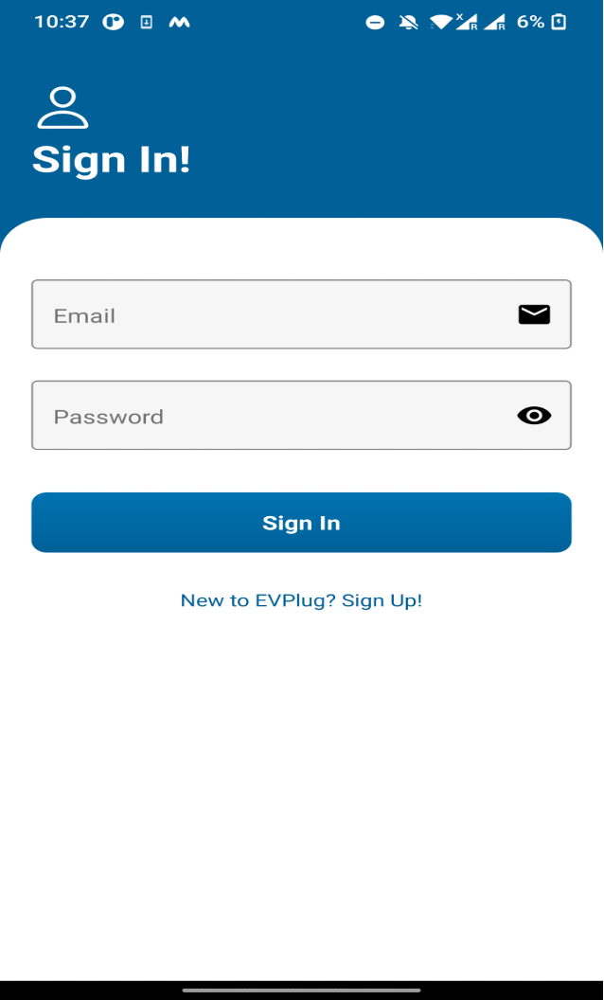
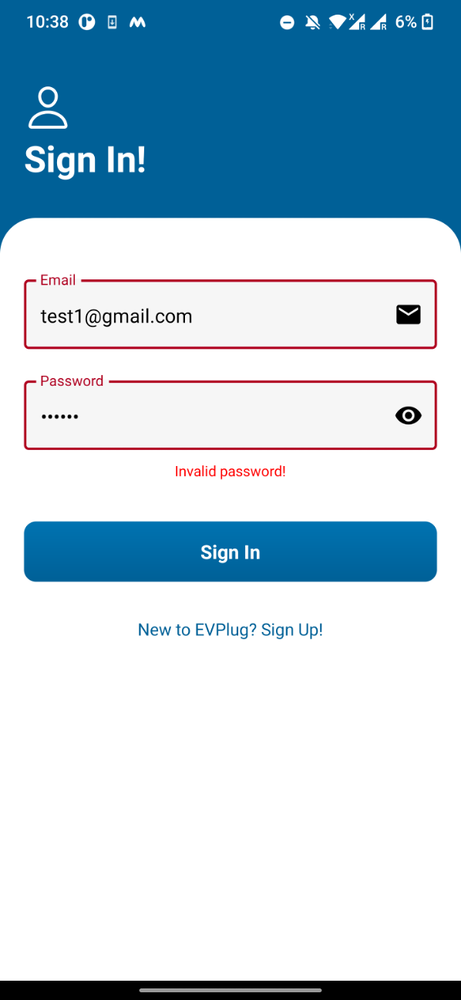
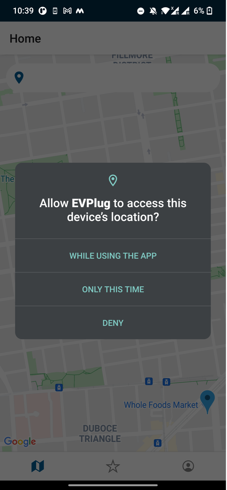
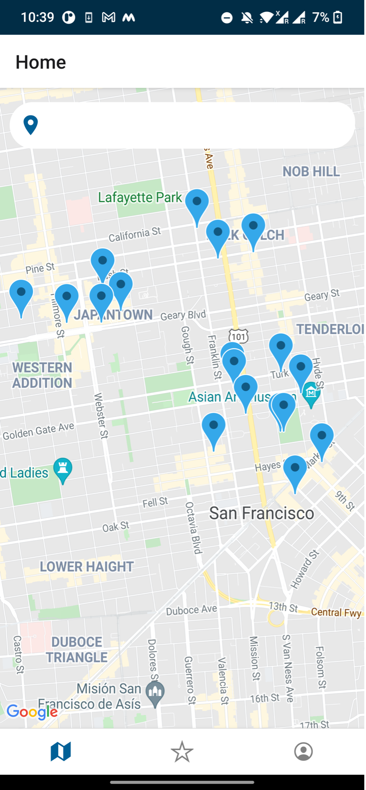
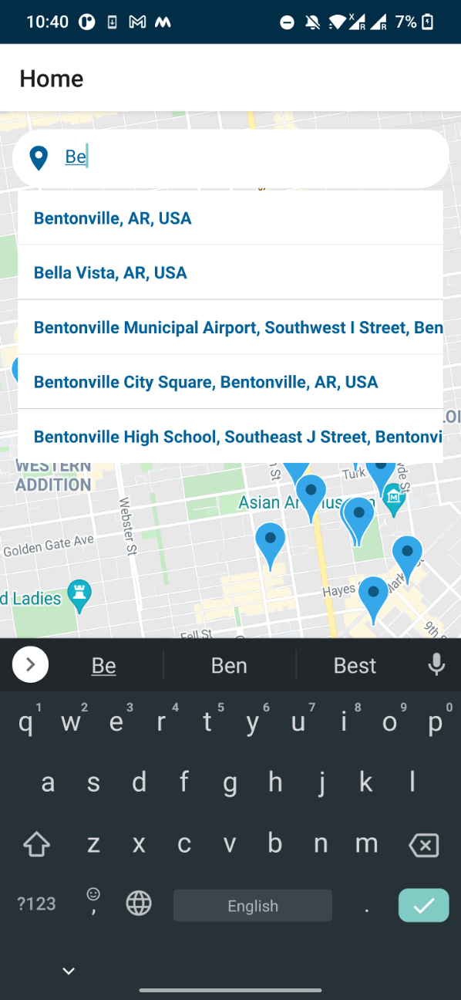
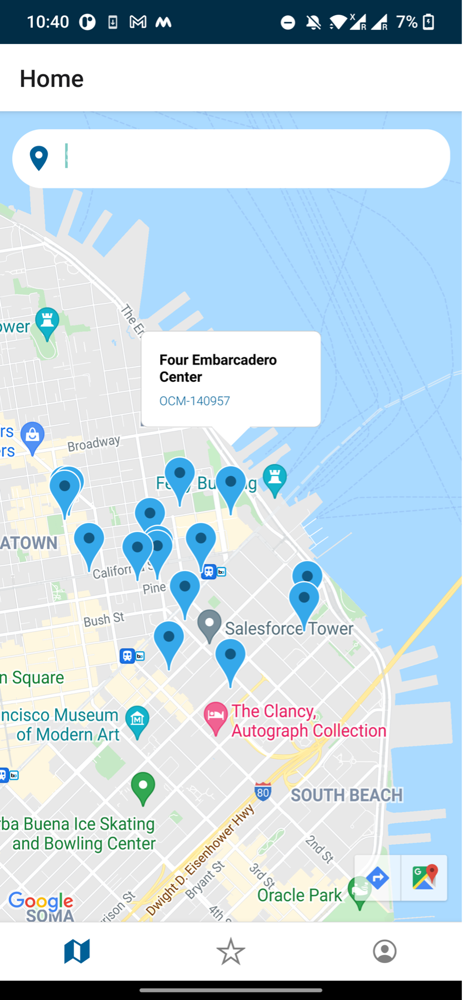
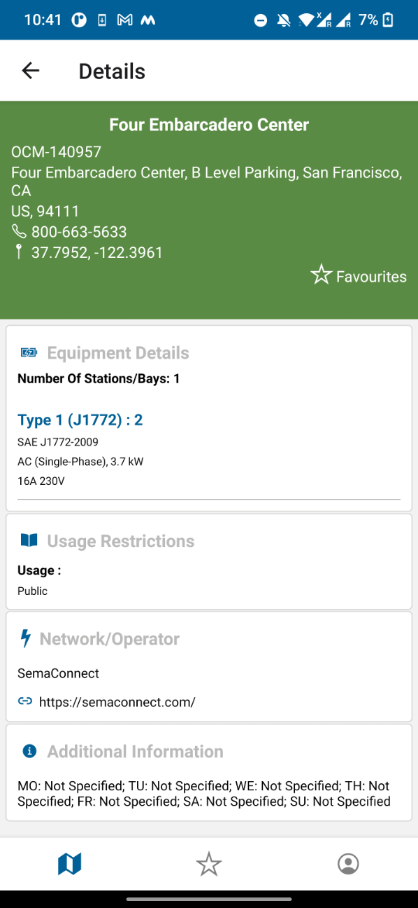
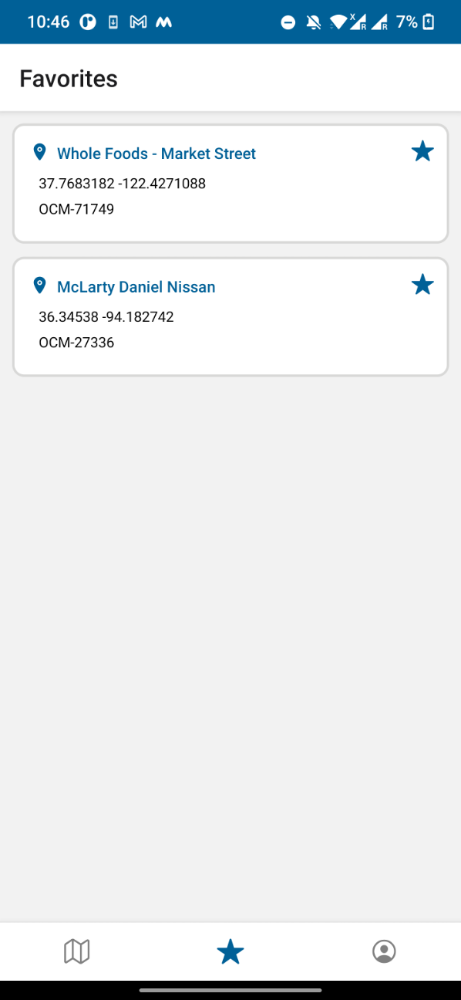
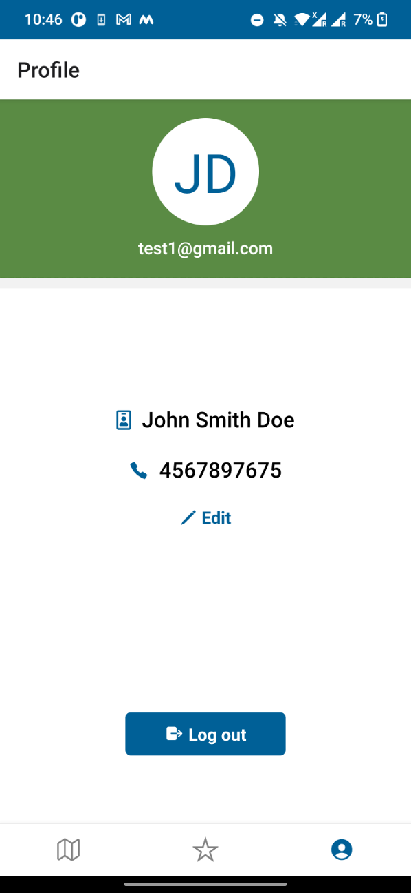
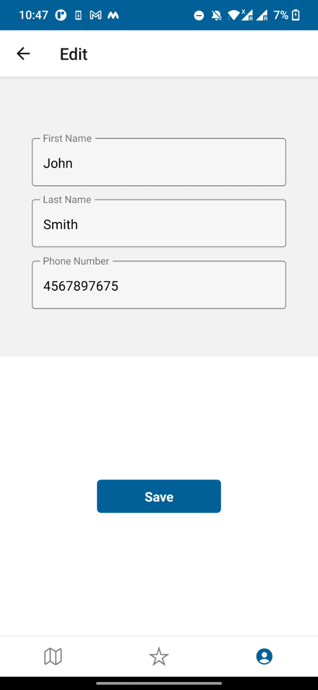

# EVPlug

An application which is used to find electric car charging station at a given location.
Technologies which were used:

React-Native to build ios and android version of the app.
Google Map Views
Permissions
Google AutoComplete Search
Open Charge Map API
Custom Authentication API (hosted on Azure): uses JWT authentication
Azure Cosmos DB API for Mongo DB
Azure App Service
Github

Have implemented Continuous Deployment pipeline using Azure App Service and Github, which deploys the changes in Azure App Service’s web app on git commit.

The approach used to build the application is component-based approach.

  
  
  

